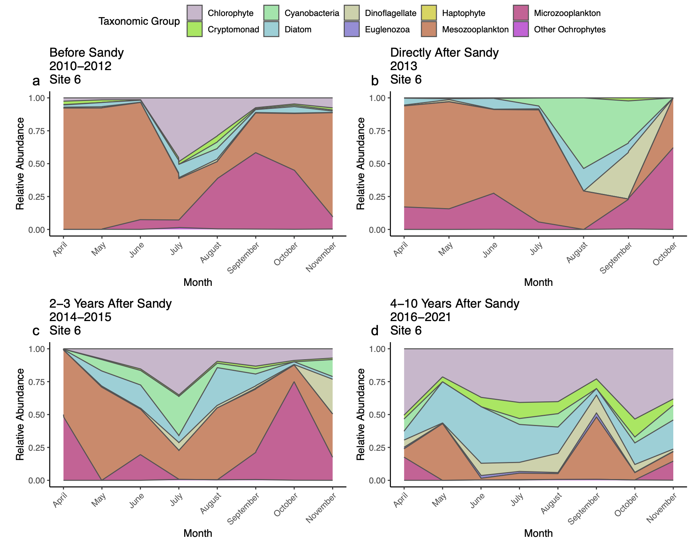

# RaritanBay_HAB_Networks
## By: Megan B. Rothenberger, Samantha J. Gleich, and Evan Flint
### Last Updated: June 12, 2022
Network analysis of the Rarity Bay Estuary phytoplankton community composition time-series dataset. See Rothenberger et al. (2014; https://doi.org/10.1007/s12237-013-9714-0) and  Rothenberger and Calomeni (2016; https://doi.org/10.1016/j.jembe.2016.03.015) for more information.

## Required packages
To run the R scripts in this repository you will need to have the following packages installed: 
- `mgcv`
- `tidyverse`
- `compositions`
- `stats`
- `psych`
- `pulsar`
- `batchtools`
- `huge`
- `igraph`
- `reshape2`
- `randomcoloR`
- `ggpubr`
- `ggplot2`
- `NetGAM`
- `missForest`

## Make taxa barplots for each site
\
\
**The R script "Figure2_Taxabarplot.R will demonstrate how to wrangle and plot data to produce a plot like this one.** 

## Make taxa barplots pre-post Hurricane Sandy
\
\
**The R script "Figure3_Taxabarplot.R will demonstrate how to wrangle and plot data to produce a plot like this one.** 

## Make a network at each site
\
\
**The R script "Figure4_Networks.R will demonstrate how to wrangle and plot data to produce a plot like this one.**

## To be continued
